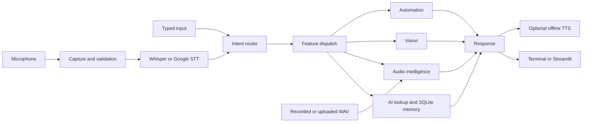

# Multimodal AI Virtual Assistant with Speech and Audio Intelligence

A modular Python portfolio project combining a terminal assistant, an optional
Streamlit interface, speech-to-text, offline text-to-speech, pretrained audio
inference, computer vision, and local desktop automation.

**Project status:** implemented prototype with automated regression tests. Live
microphone, speaker, camera, and pretrained-model performance require validation
on the target machine. No dataset-level accuracy, F1, or model benchmark results
are claimed in this repository.

## Overview

The assistant accepts typed commands or speech, routes recognized commands to
specialized modules, and produces readable responses with optional offline speech.
An audio workspace analyzes recordings and WAV uploads independently of command
recognition. SQLite provides timestamped local memory shared by both interfaces.

The project integrates existing models and services; it does not train a custom
speech, emotion, audio-event, or vision model. The chat interface is a command
interface, not an open-ended language-model chatbot.

## Motivation

This project explores how speech, audio analysis, vision, and useful desktop tasks
can share a modular application pipeline. The emphasis is on reusable components,
optional dependencies, private local storage, error recovery, and testable behavior
without requiring physical recording hardware in automated tests.

## Features

| Capability | Implementation |
| --- | --- |
| Typed and spoken commands | Rule-based normalization and intent routing |
| Speech-to-text | Optional local faster-whisper; Google SpeechRecognition default/fallback |
| Text-to-speech | Offline pyttsx3 with installed system voices |
| Voice emotion | Pretrained SUPERB Wav2Vec2 four-class inference |
| Environmental sounds | Pretrained MIT AudioSet Audio Spectrogram Transformer |
| Audio visualization | NumPy signal processing and optional Matplotlib |
| Memory | SQLite records with UTC timestamps and one-time text migration |
| Notes | Local timestamped text notes |
| Knowledge lookup | External Wikipedia summaries; browser search links |
| Desktop actions | App/folder/browser launch and confirmed power commands |
| Vision | OpenCV face/age/gender models and MediaPipe hand tracking |
| UI | Terminal and optional local Streamlit workspace |

There is **no implemented LLM chat/API integration**, retrieval-augmented generation,
or custom model-training pipeline. Opening ChatGPT in a browser is a website shortcut.
The password checker uses character-composition rules, not breach intelligence.
The original `.venv-1` is not a verified runtime; if it cannot launch, use a fresh
Python 3.12 environment as described below.

## Audio intelligence

### Capture and preprocessing

`audio_intelligence/recorder.py` supports microphone capture and integer PCM WAV
I/O (8/16/24/32-bit input, 16-bit output; a shared 128 MiB payload limit). Speech recording checks microphone support,
calibrates briefly, waits for speech, and stops after a pause. Defaults: 0.3-second
calibration, 5-second start timeout, 0.8-second trailing silence, 15-second maximum
utterance. Noise, clipping, overflow, silence and empty input are handled explicitly.
This is energy-based endpoint detection, not a trained speech activity detector.

Reusable functions provide mono conversion, anti-aliased resampling, normalization,
and silence trimming. The model wrappers use their own documented preprocessing;
event classification does not trim away quiet sounds. Audio arrays use float32
full-scale units or signed PCM, shaped `(frames,)` or `(frames, channels)`.

Temporary WAV contexts own private directories and clean them up on normal exit or
Python exceptions. Abrupt process termination can leave temporary files. WAV writes
refuse to overwrite existing files.

### Pretrained inference

- **Speech emotion:** neutral, happy, angry, sad; predicted class, model score and
  top three predictions. Results explicitly state that they are experimental AI
  inference, **not psychological or medical diagnosis**. Scores do not establish
  a person's feelings or mental health. English speech and 16 kHz model input.
- **Audio events:** top category and three to five ranked scores. AudioSet classes
  can overlap; independent sigmoid scores need not sum to 100%. Clips are analyzed
  in ten-second windows with maximum per-class scores across windows. Accepts
  0.1-60 seconds; WAV decoding is capped at 64 MiB in this wrapper.
- **Whisper STT:** conservative local defaults are `tiny.en`, CPU int8, one worker,
  and up to four CPU threads. Hardware-specific latency has not been established.

Model weights load lazily, download on first use when needed, and use library disk
caches. Inference for emotion, events and Whisper is local. Optional runtime failures
leave typed commands available. Event weights use a pinned repository revision and
safetensors; emotion uses the upstream SUPERB checkpoint.

### Visualization

Waveform, spectrogram, and Mel-spectrogram APIs accept arrays or WAV files. They
return axes or numerical power matrices for UI reuse. STFT uses a Hann window;
Mel features use triangular HTK-Mel filters. Displayed dB values are relative to the
clip maximum, not calibrated sound-pressure measurements. Headless PNG saves use
unique filenames; failed batches remove only their own outputs. Source files are
unchanged. Default generated `plots/` output is ignored by Git.

## Vision

- Haar-cascade face detection uses OpenCV's bundled cascade.
- Age/gender estimation uses separately supplied OpenCV DNN/Caffe models. Labels
  are approximate visual model outputs, not reliable demographic facts.
- MediaPipe Tasks detects hand landmarks; gesture rules count fingers and launch
  browser shortcuts. Right palm activates, one/two fingers open Google/YouTube,
  and left fist stops capture. Thumbs-up displays/logs confirmation only.
- Native camera windows run from the terminal, use camera index 0, and close with Q.
  Camera cleanup runs on errors and interruption. Gesture actions may repeat when held.

Place the following separately obtained models in the ignored `models/` directory:

```text
opencv_face_detector.pbtxt
opencv_face_detector_uint8.pb
age_deploy.prototxt
age_net.caffemodel
gender_deploy.prototxt
gender_net.caffemodel
hand_landmarker.task
```

The project does not bundle an automated vision-model downloader. Verify provenance
and licensing before redistributing externally obtained weights.

## Architecture



`main.py` is the terminal orchestrator. `AssistantPipeline` owns per-session
confirmation state; routing is pure and execution happens in dispatch. A response
object separates output from TTS. The Streamlit UI uses the same pipeline, with
browser audio capture and explicit analysis buttons. Processing is synchronous.

## Project structure

```text
main.py                         Terminal entry point
streamlit_app.py                 Optional local browser interface
assistant/                      Input, intents, routing, dispatch, responses, sessions
ai/                             Wikipedia, SQLite memory, text notes
voice/                          STT selection, voice input, offline TTS
audio_intelligence/             Recording, preprocessing, model wrappers, plots
vision/                         Face, age/gender, hand tracking, vision logs
automation/                     Desktop/browser/system helpers
cyber/                          Rule-based password composition checker
ui/audio.py                     Validated WAV upload decoding and STT conversion
evaluation/latency.py            Real wall-clock timing utility
tests/                          Unit, regression, and optional UI tests
requirements*.txt               Base and optional dependency groups
data/                           Private local SQLite data (ignored)
```

## Installation

Python 3.12 is the intended environment. From the project directory in PowerShell:

```powershell
py -3.12 -m venv .venv
.\.venv\Scripts\python.exe -m pip install -r requirements.txt
.\.venv\Scripts\python.exe main.py
```

No activation or execution-policy change is required. Recreate an environment whose
Python installation is missing. The base requirements use `opencv-contrib-python`, which also satisfies MediaPipe.
Do not additionally install `opencv-python`: both distributions provide `cv2`.
If upgrading an environment containing both, uninstall both OpenCV distributions,
then reinstall `requirements.txt` to restore a single coherent `cv2` installation.

Install optional features in the same environment:

```powershell
.\.venv\Scripts\python.exe -m pip install -r requirements-ui.txt
.\.venv\Scripts\python.exe -m pip install -r requirements-whisper.txt
.\.venv\Scripts\python.exe -m pip install -r requirements-emotion.txt
.\.venv\Scripts\python.exe -m pip install -r requirements-audio-events.txt
```

`requirements-visualization.txt` installs plotting alone. SQLite is part of Python's
standard library. Optional ML packages can be substantial; they are not required for
basic typed commands. The dependency ranges are not a fully locked environment.

## Usage

### Terminal

Type a command or press Enter for speech. Failed STT prompts for text.

| Purpose | Examples |
| --- | --- |
| Help and exit | `help`, `stop`, `exit`, `quit` |
| Search | `search Python tutorial`, `youtube search audio processing` |
| Wikipedia | `who is Albert Einstein`, `what is machine learning` |
| Time/date | `what is the time`, `what is the date`, `what day is today` |
| Memory | `remember Meet Alice at 5:30!`, `show memory`, `clear memory` |
| Notes | `take note Review the paper`, `show notes`, `clear notes` |
| Emotion | `analyze my voice emotion` then record a fresh sentence |
| Events | `classify audio`, `classify wav "C:\Audio\sample.wav"` |
| Automation | `open google`, `open github`, `open notepad`, `open downloads folder` |
| Power | `shutdown computer`, `restart computer`, `cancel shutdown` |
| Vision | `face detection`, `start age detection`, `hand tracking`, `show vision logs` |
| Demo security | `check password Hello@123` (demo values only) |

Power actions require exact confirmation or cancellation; confirmations are consumed
before execution. Windows schedules power actions with a ten-second delay. Other
platforms use native commands and may require privileges. App launchers must exist
on the system. The standalone file organizer is not exposed as a command.

### Streamlit

```powershell
.\.venv\Scripts\python.exe -m streamlit run streamlit_app.py --server.address 127.0.0.1 --server.maxUploadSize 20
```

The interface includes assistant chat, browser microphone recording, PCM WAV upload,
transcription, emotion/event results and scores, three downloadable plots, memory
view/save/clear, and assistant responses. Audio is analyzed only after clicking an
action. Sending a transcript to the router requires its own button. Changing the
input clip clears old analysis results. Upload limits are 20 MiB and 0.1-60 seconds.

Native vision windows remain terminal-only. Desktop automation and host-speaker TTS
are opt-in UI settings. This is a **single-user localhost application**, not an
authenticated multi-user service. Memory is shared across local interfaces; audio
and chat state are session-specific and are not globally cached.

### Configuration

Environment variables are read directly; `.env` files are not automatically loaded.

| Variable | Default / options |
| --- | --- |
| `ASSISTANT_MEMORY_DB` | `data/memory.sqlite3`; alternate local path |
| `ASSISTANT_STT_BACKEND` | `google`; `whisper` or `auto` tries Whisper first |
| `ASSISTANT_STT_GOOGLE_FALLBACK` | `true`; set `false` to prevent Google fallback |
| `ASSISTANT_WHISPER_MODEL` | `tiny.en`; multilingual `tiny` or local model path |
| `ASSISTANT_WHISPER_LANGUAGE` | `en`; language code or `auto` |
| `ASSISTANT_WHISPER_LOCAL_ONLY` | `false`; `true` requires cached/local weights |
| `ASSISTANT_TTS_RATE` | `165`; integer 50-400 words/minute |
| `ASSISTANT_TTS_VOLUME` | `1.0`; 0-1, zero disables speech |
| `ASSISTANT_TTS_VOICE` | System default; exact installed ID/name |
| `ASSISTANT_TTS_ENABLED` | `true`; `false` enables text-only responses |
| `ASSISTANT_TTS_CHUNK_LENGTH` | `180`; 40-1000 characters |

The Streamlit STT selector overrides backend selection for its own requests.
`voice.speak.list_voices()` lists installed voices. Long TTS responses are chunked
without silent truncation, and full text is printed before playback. Native driver
calls have no hard timeout. Missing voices revert to the system default.

### SQLite migration

On first memory access, the store creates its schema and imports nonempty lines
from `memory.txt` exactly once in a transaction. Rows contain `id`, `content`, UTC
`created_at`, and `source`. Legacy timestamps are import times; original creation
times are unknown. The source text is preserved as a backup, and the import marker
prevents re-import after `clear memory`. Clear removes active database rows, **not
the retained legacy backup or historical Git commits**. Deleting/replacing the
SQLite database can cause a new import from that backup. Notes remain text-based.

### Reusable APIs

```python
from assistant.pipeline import AssistantPipeline
response = AssistantPipeline().handle("what is the time")
print(response.text)

from audio_intelligence import read_wav
from audio_intelligence.visualization import generate_audio_plots
from pathlib import Path
samples, rate = read_wav("sample.wav")
Path("plots").mkdir(exist_ok=True)
paths = generate_audio_plots(samples, rate, "plots")
```

Emotion and audio-event wrappers support arrays and local inference; the latter also
provides `classify_wav` and `classify_microphone`. `local_files_only=True` prevents
model downloads. Existing callable-backend adapters remain available for experiments.

## Model sources and external services

| Component | Source and role |
| --- | --- |
| Whisper | [SYSTRAN faster-whisper](https://github.com/SYSTRAN/faster-whisper), CTranslate2 implementation of pretrained Whisper |
| Emotion | [SUPERB Wav2Vec2](https://huggingface.co/superb/wav2vec2-base-superb-er), pretrained English IEMOCAP emotion classifier |
| Audio events | [MIT AST AudioSet checkpoint](https://huggingface.co/MIT/ast-finetuned-audioset-10-10-0.4593), through [Transformers AST](https://huggingface.co/docs/transformers/model_doc/audio-spectrogram-transformer) |
| Hand landmarks | [MediaPipe Hand Landmarker](https://ai.google.dev/edge/mediapipe/solutions/vision/hand_landmarker), followed by project gesture rules |
| Face detection | [OpenCV](https://opencv.org/), Haar cascade and separately supplied DNN models |
| Online STT | [SpeechRecognition](https://github.com/Uberi/speech_recognition), Google recognition endpoint |
| Offline TTS | [pyttsx3](https://github.com/nateshmbhat/pyttsx3), installed OS voices |
| Knowledge lookup | Wikipedia package and external Wikipedia content |

Model and dependency licenses remain those of their respective publishers. Model
integration is not authorship of the pretrained model, dataset, or upstream research.

## Evaluation

Run the microphone-free test suite:

```powershell
.\.venv\Scripts\python.exe -B -m unittest discover -s tests -v
```

Coverage includes command normalization/routing, PCM conversion, resampling,
silence/invalid audio, WAV safety, SQLite migration/CRUD, model output wrappers,
backend fallback, TTS failure cleanup, plotting, and optional Streamlit interactions.
Model/driver calls are mocked. UI/render tests require their optional dependencies;
they are skipped when unavailable. Passing these tests does not validate recognition
accuracy, sound quality, hardware compatibility, or actual model runtime performance.

Measure actual call latency using a real WAV:

```powershell
.\.venv\Scripts\python.exe -m evaluation.latency whisper sample.wav --runs 3 --warmup 1
.\.venv\Scripts\python.exe -m evaluation.latency emotion sample.wav --runs 3 --warmup 1 --output evaluation_results/emotion.json
.\.venv\Scripts\python.exe -m evaluation.latency events sample.wav --runs 3 --warmup 1
```

`google` is also supported and sends that WAV to Google. The utility records
wall-clock samples, mean/median/min/max, failed runs, and real-time factor. Warmup durations are recorded separately; a failed warmup aborts with an error rather
than producing a misleading report. Audio
decoding is excluded. Audio-model load time is reported separately; STT warmup can
include model loading/download. Wrapper preprocessing and online STT network time
are included. A Whisper benchmark calls Whisper directly and never silently times
a Google fallback. Failure runs are not counted as successes. Output files refuse
overwrite and do not include audio or transcripts.

UI timing is a single end-to-end request measurement and may include downloads,
model loading, and fallback. It is not a controlled benchmark. No labelled dataset
has been evaluated here; **accuracy, precision, recall, F1 and WER are not reported**.
Latency measurements alone cannot establish prediction quality.

## Limitations

- Rule-based commands have limited language coverage and some legacy substring
  matching. There is no general conversation model or autonomous planning.
- Pretrained model predictions can be wrong, especially across accents, languages,
  domains, recording conditions and overlapping sounds.
- Energy-based capture may mistake background speech/music for a command.
- Synchronous camera/model calls block their session; model caches consume memory.
- SQLite data is local and unencrypted, and the UI has no authentication.
- Native automation and audio drivers are platform-dependent. Live hardware and
  pretrained inference have not been comprehensively tested on this machine.
- Dependency ranges are not a reproducible benchmark environment or a full lockfile.

## Responsible AI and privacy

Emotion results are experimental acoustic labels, not psychological/medical diagnosis
or a basis for consequential decisions about people. Confidence scores are model
outputs, not evidence of truth. Audio-event detection is not a safety monitoring system.

Use recordings you are authorized to process. Google STT/fallback transmits audio;
local Whisper, emotion and event inference do not. Model downloads contact upstream
hosts. Browser audio reaches the local Streamlit server. Temporary upload/plot files
are cleaned up; downloaded plots are controlled by the user. Logs and model caches
can remain on disk. Runtime data, database sidecars, recordings generated outside
tracked paths, and secrets should not be committed. Default data/log/plot/model paths
and SQLite file patterns are ignored; Git ignores do not erase existing history.

Use demo passwords only. Notes, memory, terminal output, backups and downloaded
plots may contain personal information. Keep this UI bound to localhost; adding
multi-user hosting requires authentication, isolation and permissions design.

## Future work

- Labelled, consented evaluation with defined splits, WER/F1/accuracy and uncertainty.
- Reproducible dependency/model manifests and measured CPU/memory profiling.
- Improved VAD, multilingual commands, cancellation and asynchronous UI workers.
- Authenticated user isolation, configurable retention and encrypted local storage.
- Optional, explicitly documented LLM/API integration with clear data boundaries.
- Browser-native vision controls and accessible audio feedback.

Author: Salman Farshi
